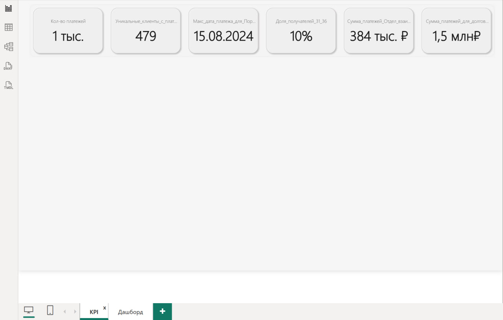

# Тестовое задание для коллекторского агентсва

▌ Задание:

1. В Power BI создать KPI:
      - Количество платежей;
      - Количество уникальных клиентов с платежами;
      - Максимальная дата платежа для Потрфеля1;
      - Доля получателей c кодами 31 и 36 в общей сумме платежей;
      - Сумма платежей для внутренней службы "Отдел взаимодействия"
      - Сумма платежей для долгов, купленных более 180 дней назад.
2. Создать произвольный дашборд. 

---

▌Скриншоты дашбордов:

  
  

